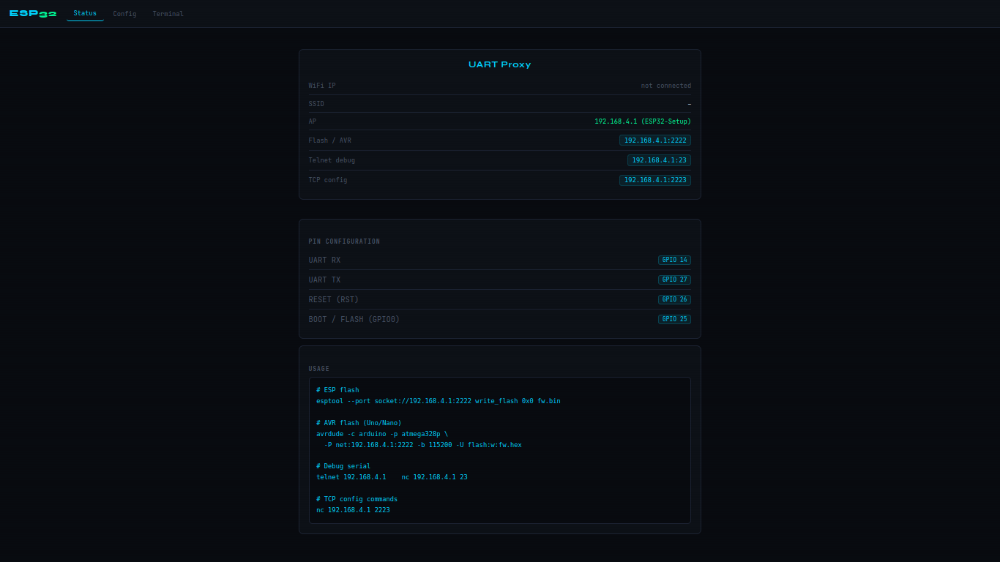

# ESP32 WiFi Serial Bridge

WiFi-to-UART bridge firmware for ESP32, written in MicroPython.  
Flash AVR and ESP boards over WiFi, monitor serial output in a browser terminal, tunnel raw UART over TCP — all wirelessly.

Inspired by [esp-link](https://github.com/jeelabs/esp-link), built entirely in MicroPython.

---

## Screenshots

### Status page


### Config page


### Terminal (Console)


---

## Features

- **Web terminal** — live serial console in the browser (xterm.js), keyboard input, macros
- **AVR flash over WiFi** — avrdude connects to `:2222`, ESP32 resets the AVR and proxies STK500
- **ESP flash over WiFi** — esptool connects to `:2222`, ESP32 puts target into bootloader mode
- **Auto-reset after flash** — target is reset automatically when flash session ends
- **Raw TCP tunnel** — plain UART pass-through on port `:23` (telnet / socat / mpremote)
- **Config server** — telnet to `:2223` for runtime commands
- **WiFi setup AP** — on first boot, ESP32 broadcasts a hotspot for WiFi configuration
- **Watchdog** — auto-reboot if the bridge thread stops for more than 10 seconds

---

## Hardware

Tested on **ESP32 DevKit v1** and **WEMOS LOLIN D32 Pro**.  
Any ESP32 board with accessible GPIO works.

### Wiring

| ESP32 GPIO | Function | Connect to |
|-----------|----------|------------|
| 32 | UART RX | Target TX |
| 33 | UART TX | Target RX |
| 13 | RST | Target RESET (via 100 Ω resistor) |
| 14 | BOOT | Target GPIO0 / BOOT (ESP targets only) |
| GND | GND | Target GND |

> Use a 100 Ω series resistor on RST to avoid conflicts with other reset sources (buttons, capacitors).

### Supported targets

| Target | Port | Reset method |
|--------|------|-------------|
| Arduino Uno / Nano (optiboot 115200) | `:2222` | RST pulse on TCP connect |
| Arduino Mega | `:2222` | RST pulse on TCP connect |
| ESP8266 / ESP32 | `:2222` | BOOT + RST pins on TCP connect |
| Any UART device | `:23` | — |

---

## File structure

```
main.py          — Bridge thread, WebSocket server, TCP servers
wifi_setup.py    — WiFi AP setup, HTTP server, REST API
terminal.html    — Web serial console (xterm.js)
status.html      — Status and info page
config.html      — WiFi configuration page

tools/
  flash_debug.py   — Lightweight standalone proxy, import from REPL
  FLASH_DEBUG.md   — Documentation for flash_debug.py
```

---

## Installation

### 1. Flash MicroPython onto the ESP32

```bash
pip install esptool

# Erase first
esptool --chip esp32 --port /dev/ttyUSB0 erase_flash

# Flash MicroPython
esptool --chip esp32 --port /dev/ttyUSB0 --baud 460800 \
  write_flash -z 0x1000 esp32-20240105-v1.22.1.bin
```

Download firmware: https://micropython.org/download/ESP32_GENERIC/

### 2. Upload project files

```bash
pip install mpremote

mpremote connect /dev/ttyUSB0 cp main.py :
mpremote connect /dev/ttyUSB0 cp wifi_setup.py :
mpremote connect /dev/ttyUSB0 cp terminal.html :
mpremote connect /dev/ttyUSB0 cp status.html :
mpremote connect /dev/ttyUSB0 cp config.html :
mpremote connect /dev/ttyUSB0 reset
```

Or use **Thonny**: open each file → File → Save as → MicroPython device.

---

## First boot — WiFi setup

1. Power the ESP32
2. Connect your phone or laptop to **`ESP32-Setup`** (password: `12345678`)
3. Open `http://192.168.4.1` in a browser
4. Enter your home WiFi credentials and click **Connect**
5. ESP32 saves them to `config.json` and connects
6. The IP is printed on the serial console:

```
========================================
IP:        192.168.1.100
Console:   http://192.168.1.100/terminal.html
Telnet:    telnet 192.168.1.100
Flash:     socket://192.168.1.100:2222
Config:    nc 192.168.1.100 2223
========================================
```

---

## Web pages

### Status — `http://<ip>/status.html`


Shows the current state of the bridge:
- WiFi IP and SSID
- AP mode address if active
- Ready-to-use flash, telnet and config commands with the current IP
- Pin configuration (RX, TX, RST, BOOT)

### Config — `http://<ip>/config.html`


- **Hardware Reset** — pulses RST pin, reboots the connected target device
- **Baud Rates** — set ESP flash, AVR flash and debug baud rates independently, then save
- **WiFi** — stop/start AP mode, scan for networks, connect to a different network
- **Device** — reboot the ESP32 bridge itself (`machine.reset()`)

### Terminal — `http://<ip>/terminal.html`


Live serial console in the browser over WebSocket.

**Layout:**
- Left sidebar — controls, baud rate selector, macros, stats
- Main area — xterm.js terminal. Click to focus, type to send raw bytes
- Bottom bar — line input. Type a command and press **Enter** or **SEND** to send with `\r\n`
- Top right — connection status indicator

**Sidebar controls:**

| Control | Description |
|---------|-------------|
| Hardware Reset | Pulses RST pin — reboots the connected target |
| Baud rate | Changes debug UART baud on the fly |
| ^C / ^D / ^B | Send Ctrl+C, Ctrl+D, Ctrl+B |
| CRLF | Send `\r\n` |
| help() | Send `help()\r\n` (MicroPython) |
| reboot | Send `import machine;machine.reset()\r\n` |
| ls | Send `import uos;uos.listdir()\r\n` |
| ^A raw | Send Ctrl+A (MicroPython raw REPL mode) |
| Clear | Clear the terminal buffer |
| Download log | Save full session to `.txt` |
| Autoscroll | Toggle auto-scroll |

**Stats** (bottom of sidebar): RX bytes, TX bytes, uptime, WebSocket URL.

---

## Network ports

| Port | Protocol | Description |
|------|----------|-------------|
| 80 | HTTP | Web interface |
| 81 | WebSocket | Serial terminal (terminal.html) |
| 23 | TCP | Raw UART tunnel — telnet / socat / mpremote |
| 2222 | TCP | Flash proxy — avrdude / esptool |
| 2223 | TCP | Text config and control |

---

## Flashing AVR over WiFi

### avrdude command

```bash
avrdude -c arduino -p atmega328p \
  -P net:192.168.1.100:2222 \
  -b 115200 \
  -U flash:w:firmware.hex:i
```

### platformio.ini

```ini
[env:uno_wifi]
platform = atmelavr
board = uno
framework = arduino
upload_protocol = custom
upload_port = socket://192.168.1.100:2222
upload_flags =
    -C${platformio.packages_dir}/tool-avrdude/avrdude.conf
    -p$BOARD_MCU
    -carduino
    -P$UPLOAD_PORT
    -b115200
```

### What happens

1. avrdude opens TCP connection to `:2222`
2. ESP32 pulses RST (10 ms) — AVR enters optiboot bootloader
3. Waits up to 2 seconds for first byte from avrdude
4. Detects `0x30` (STK_GET_SYNC) — starts tunnel at 115200
5. Forwards all data bidirectionally until avrdude disconnects
6. ESP32 pulses RST again — AVR starts the new firmware

> `ioctl("TIOCMGET"): Inappropriate ioctl` warnings from avrdude are **normal**.  
> Reset is handled by the RST pin, not DTR/RTS. Ignore these warnings.

---

## Flashing ESP / ESP8266 over WiFi

### Test command

```bash
esptool --chip esp32 --baud 115200 \
  --port socket://192.168.1.100:2222 \
  write_flash 0x1000 ESP32_GENERIC-20240105-v1.22.1.bin
```

### platformio.ini

```ini
[env:esp32_wifi]
platform = espressif32
board = esp32dev
framework = arduino
upload_protocol = esptool
upload_port = socket://192.168.1.100:2222
upload_speed = 115200
```

### What happens

1. esptool opens TCP connection to `:2222`
2. ESP32 pulses RST (avrdude compatibility) then waits for first byte
3. Detects `0xC0` (SLIP sync) — performs ESP boot reset:
   ```
   BOOT = LOW
   RST  = LOW  →  wait 100ms  →  RST = HIGH   (chip enters ROM bootloader)
   wait 50ms   →  BOOT = HIGH
   wait 300ms  (ROM bootloader startup)
   ```
4. Flushes UART noise from reset
5. Starts tunnel — esptool uploads stub flasher, then flashes at full speed
6. When esptool disconnects — ESP32 pulses RST to boot new firmware

---

## Raw UART tunnel — port 23

Plain bidirectional UART pass-through. No reset, no baud change.

### telnet

```bash
telnet 192.168.1.100
```

### socat — virtual serial port (useful for tools that need a COM port)

```bash
socat -d -d PTY,link=/tmp/uart0,raw,echo=0,b115200 TCP:192.168.1.100:23
```

This creates `/tmp/uart0` as a virtual serial port linked to the UART tunnel.  
Any tool that expects a `/dev/ttyUSBx` can now use `/tmp/uart0` instead.

### mpremote over WiFi via socat

```bash
# Terminal 1 — start the virtual port
socat -d -d PTY,link=/tmp/uart0,raw,echo=0,b115200 TCP:192.168.1.100:23

# Terminal 2 — connect mpremote to the virtual port
mpremote connect /tmp/uart0
```

This gives you a full mpremote session (REPL, file transfer, run scripts)  
over WiFi without a USB cable.

### nc (netcat)

```bash
nc 192.168.1.100 23
```

---

## Config server — port 2223

```bash
nc 192.168.1.100 2223
```

### Commands

| Command | Description |
|---------|-------------|
| `RESET` | RST pulse 100 ms — normal reboot of target |
| `ESPRESET` | BOOT + RST — target ESP enters ROM bootloader |
| `AVRRESET` | RST pulse 10 ms — AVR optiboot |
| `REBOOT` | `machine.reset()` — reboots the bridge ESP32 itself |
| `DEBUGBAUD <n>` | Set debug tunnel baud (e.g. `DEBUGBAUD 9600`) |
| `ESPBAUD <n>` | Set ESP flash baud |
| `AVRBAUD <n>` | Set AVR application baud |
| `STATUS` | Print IP, baud rates, TCP busy flag, watchdog age |
| `HELP` | List all commands |

---

## HTTP API

| Endpoint | Method | Body | Description |
|----------|--------|------|-------------|
| `/api/status` | GET | — | JSON: ip, wifi, ssid, ap, baud |
| `/scan` | GET | — | WiFi networks: `[{ssid, rssi}]` |
| `/connect` | POST | `ssid=&pass=` | Connect to WiFi |
| `/reset` | POST | `type=normal\|esp\|avr` | Reset target device |
| `/baud` | POST | `dbg=115200` | Change debug baud |
| `/reboot` | POST | — | Reboot the bridge (`machine.reset`) |
| `/startap` | POST | — | Start AP mode |
| `/stopap` | POST | — | Stop AP mode |

---

## Configuration

### main.py

```python
DEBUG_LEVEL = 2     # 0=off  1=errors  2=info  3=verbose

PIN_RX   = 32       # UART RX ← target TX
PIN_TX   = 33       # UART TX → target RX
PIN_RST  = 13       # RST    → target RESET
PIN_BOOT = 14       # BOOT   → target GPIO0 (ESP targets only)

baud = {
    "esp": 115200,  # esptool flash baud
    "avr": 115200,  # AVR application baud (optiboot is always 115200)
    "dbg": 115200,  # debug / telnet baud
}

WD_TIMEOUT = 10000  # watchdog timeout in ms
```

### wifi_setup.py

```python
AP_SSID = "ESP32-Setup"   # hotspot name on first boot
AP_PASS = "12345678"      # hotspot password (min 8 chars)
```

---

## Architecture

```
┌─────────────────────────────────────────────────────────┐
│                        ESP32                            │
│                                                         │
│  Thread: web_server (:80)                               │
│    GET  → serve .html files                             │
│    POST → /reset /baud /connect /reboot                 │
│                                                         │
│  Main loop                                              │
│    select() on :81 :2222 :23 :2223                      │
│    ws_tick() — rx_buf → WebSocket → browser             │
│              — browser → tx_buf  → bridge               │
│                                                         │
│  Thread: uart_bridge                                     │
│    tx_buf → uart.write()                                │
│    uart.read() → rx_buf   (skips when TCP active)       │
│    executes _do_reset / _do_baud flags                  │
│                                                         │
│  Thread: watchdog                                       │
│    machine.reset() if bridge silent for 10 s            │
│                                                         │
│  Thread/conn: tcp_tunnel (:2222 / :23)                  │
│    direct uart.read() / uart.write() — no ring buffers  │
│    resets target on disconnect                          │
└──────────────────┬──────────────────────────────────────┘
                   │ UART  GPIO 32/33
                   │ RST   GPIO 13
                   │ BOOT  GPIO 14
             ┌─────▼──────┐
             │   Target   │
             │ Arduino /  │
             │  ESP8266   │
             └────────────┘
```

---

## tools/flash_debug.py

A minimal standalone proxy — no web interface, no ring buffers, no background threads for UART. Import it directly from the REPL for quick testing without touching `main.py`.

```python
# In WebREPL or Thonny (WiFi must already be connected):
import flash_debug
```

Starts the same three TCP ports (`:2222` / `:23` / `:2223`). Press **Ctrl+C** to stop.

**When to use it:**
- Testing hardware wiring before deploying `main.py`
- If `flash_debug.py` works but `main.py` does not → issue is in the bridge thread, not hardware
- Quick one-off flash session without rebooting

See [`tools/FLASH_DEBUG.md`](tools/FLASH_DEBUG.md) for full documentation.

---

## Troubleshooting

**Terminal shows nothing / stops updating**  
Check that port 81 is reachable. Refresh — WebSocket reconnects in 3 s.  
Look for `[WS]` lines on the ESP32 serial console.

**AVR flash: `initialization failed, rc=-1`**  
Check RST wiring (GPIO 13 → AVR RESET via 100 Ω).  
Use `-c arduino`, not `-c stk500v2`. Baud must be `-b 115200`.

**ESP flash: `Failed to connect` / `No serial data received`**  
Check BOOT wiring (GPIO 14 → target GPIO0).  
Without the BOOT pin, the target cannot enter ROM bootloader mode.

**ESP flash: `The chip stopped responding` mid-flash**  
Make sure you are running the latest `main.py` — this was caused by  
`uart_bridge_thread` and the flash tunnel both reading UART simultaneously.

**avrdude `ioctl TIOCMGET` warnings**  
Normal. Ignore them. Reset is handled via GPIO, not DTR/RTS.

**ESP32 bridge reboots randomly**  
Watchdog triggered. Usually a stalled `uart.write()` when target TX is held low.

**WiFi credentials lost after reboot**  
`config.json` is on the MicroPython filesystem. If flash was erased, run first-boot WiFi setup again.

---

## License

MIT
